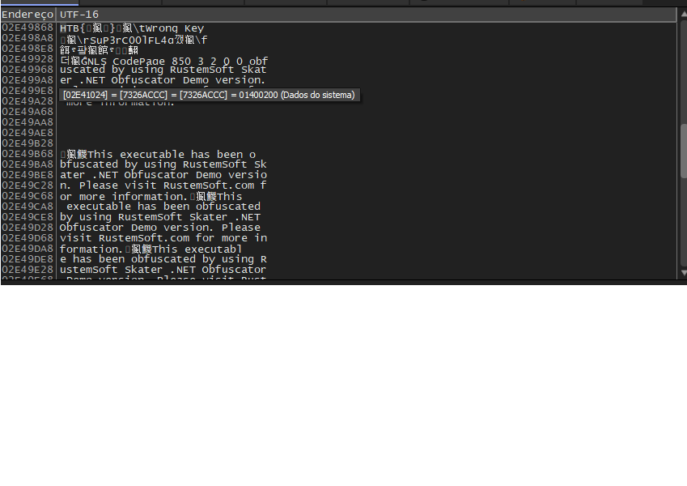

  

  <h3>FIAP 2026 — COMPUTER_ARCHITECTURE_MEMORY_ASSEMBLY_AND_DEBUGGERS_1SM_2026</h3>
  
  

    
    
    
  

  

    
    
    
    
  

   

  <h1>🛡️ Checkpoint 1: Writeup de Engenharia Reversa (Bypass.exe)</h1>
  
   

  
  
  **[▶️ Assistir Demonstração no YouTube](https://www.youtube.com/watch?v=WN3zRoRbf9U)**
  *(Flag revelada em 17:26)*

   
  

## 📄 Introdução

Este documento apresenta o *writeup* completo do processo de engenharia reversa do desafio **Bypass**, da plataforma **Hack The Box (HTB)**. O objetivo é analisar o binário `Bypass.exe` para identificar as credenciais de acesso (usuário e flag/senha) através de análise dinâmica de memória.

**Instruções do Checkpoint:**
- 🎯 Obter a flag usando o `x32dbg`.
- 📝 Documentar o passo a passo (Writeup).
- 🧠 Garantir que o processo técnico seja claro, demonstrando o domínio das ferramentas de depuração.

---

## 🛠️ Preparação do Ambiente

Para realizar esta análise, foram seguidos os requisitos iniciais:

1. **Download das ferramentas**:
    - [x64dbg/x32dbg](https://x64dbg.com/) — Debugger open-source para Windows.
    - [Detect It Easy (DIE)](https://github.com/horsicq/Detect-It-Easy) — Para triagem inicial do arquivo.
2. **Download do Desafio**:
    - Binário **Bypass** obtido no [Hack The Box Challenges](https://app.hackthebox.com/challenges/bypass).

---

## 🔍 Processo Técnico (Step-by-Step)

### 1. Triagem e Reconhecimento (Static Analysis)

Antes de executar o binário, foi realizada uma análise estática (triage) para entender a arquitetura do programa:

- 🏗️ **Arquitetura:** 32-bit (x86).
- ⚙️ **Framework:** .NET Framework 4.5.2.
- 💡 **Observação:** Como é um binário .NET, ele normalmente usa o runtime do CLR (Common Language Runtime), o que significa que o código é compilado JIT (Just-In-Time) durante a execução.

### 2. Análise de Código (dnSpy/ILSpy)

Para entender a lógica de proteção, o binário foi aberto em um descompilador .NET.

- 🔓 **Descoberta:** O programa utiliza a classe `RijndaelManaged` (uma variante do AES) para criptografia.
- 🔄 **Lógica de Comparação:** Identificou-se que o programa lê um fluxo de bytes cifrados de um recurso interno, descriptografa-os em tempo de execução e compara o resultado com a entrada do usuário através de `System.String.Equality`.

### 3. Análise Dinâmica e Depuração (x32dbg)

Com a lógica mapeada, iniciamos a depuração dinâmica para extrair a flag diretamente da memória RAM antes da criptografia ser desfeita ou logo após a descriptografia.

1. **Carga no Debugger:** Carregamos o `Bypass.exe` no **x32dbg**.
2. **Ignorando o Runtime:** Utilizamos o comando *Run to user code* para passar pelas camadas iniciais de inicialização do Windows e do runtime .NET.
3. **Referências de String:** Buscamos por referências de string em todos os módulos. Localizamos strings sugestivas como `"Congratulations!"`, `"Invalid"` e o prefixo esperado da flag `"HTB"`.
4. **Pontos de Interrupção (Breakpoints):**
    - Definimos breakpoints em funções de comparação de strings.
    - Monitoramos o fluxo de execução até que o programa aguardasse a entrada do usuário.
5. **Inspeção de Memória e Registradores:**
    - Ao chegar no ponto de comparação, inspecionamos os registradores **EAX** e **EDX**.
No dump de memória, a flag foi encontrada em texto claro (*plain text*), pronta para ser comparada com a senha digitada pelo usuário.

---

## 📸 Prova da Flag

Abaixo, a captura de tela demonstrando o momento exato em que a flag foi interceptada na memória durante a depuração:

  
   
  <em>Figura 1: Dump de memória no x32dbg revelando a flag.</em>

---

## 🚩 Resultados Obtidos

Ao monitorar o heap de memória durante a validação da entrada:

- 📍 **Localização:** Registrador `EDX` / aba de referências de string.
- 🚩 **Flag Encontrada:** `HTB{...}` (Conforme demonstrado no vídeo em **17:26**).
- ⚠️ **Vulnerabilidade Técnica:** O software armazena o segredo descriptografado em memória de forma insegura para realizar a comparação de strings, permitindo a extração fácil através de técnicas de depuração dinâmica.

---

## 🎓 Conclusão

O desafio demonstrou com sucesso como a análise dinâmica pode superar camadas de criptografia (como AES) se a implementação final realizar a verificação em um ambiente não ofuscado. O uso correto do `x32dbg` permitiu interceptar a informação no momento exato em que ela residia na memória volátil (RAM) sem a necessidade de conhecimento prévio da chave de descriptografia original.
